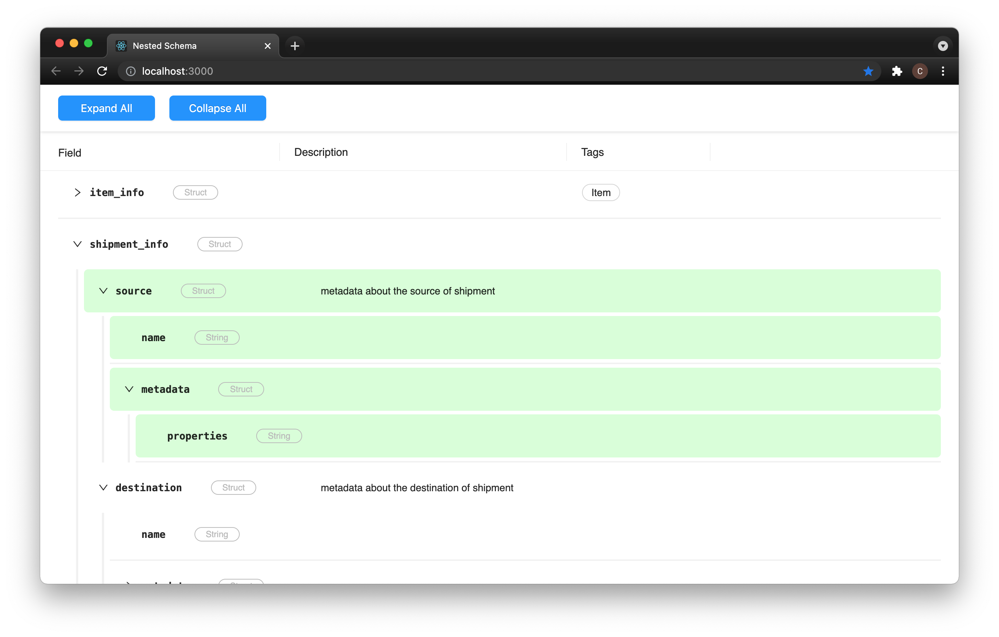

#Nested Schema 

The `NestedSchemaTable` component takes in two structs, `schemaA` and `schemaB` and visualizes the delta between them:\
Green highlighted rows indicate fieldpaths that exist in A but do not exist in B. Red highlighted rows indicate fieldpaths that exist in B but do not exist in A.  

##Technologies
`React.js`

##Installation

Clone this repository:\
`git clone https://github.com/cmillecan/`

From the project root directory:

Download dependencies: `npm install`

Run app:\
`npm run start`